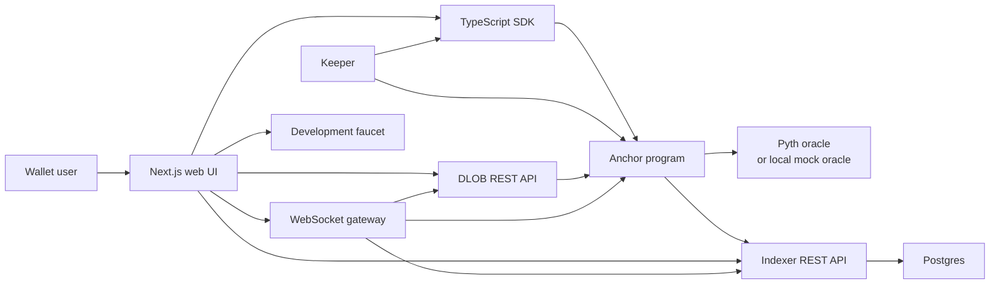

# impl.trade

impl.trade is a capstone perpetual-futures DEX built on Solana. The project combines an
Anchor/Rust settlement engine with a TypeScript service layer and a Next.js trading UI:
orders settle on-chain, services index and fan out live market data, and the frontend gives
users a complete trading, portfolio, and history experience.

This is a devnet/capstone system, not audited production software and not for real funds.

## What The Project Does

- **Perps engine:** collateral accounts, vAMM opens/closes, margin checks, funding,
  partial liquidation, insurance-fund bankruptcy resolution, and multi-market isolation.
- **Orders:** market opens, limit orders, reduce-only closes, maker-vs-maker matching, and
  reduce-only stop-loss / take-profit triggers.
- **Markets:** SOL-PERP, BTC-PERP, and ETH-PERP with Pyth oracle mode for deployed/devnet
  environments and deterministic mock-oracle mode only for local development.
- **Services:** keeper, DLOB orderbook REST API, Postgres indexer/history API, WebSocket
  gateway, and development faucet.
- **Frontend:** trade page with chart, orderbook, recent trades, order ticket, and
  positions; portfolio page; history page with fills, funding, liquidations, and CSV links.
- **SDK and scripts:** typed SDK, PDA helpers, fixed-point preview math, local bootstrap,
  price pusher, and smoke-test workflow.

## System Design



The program is the source of truth for balances, positions, orders, fills, funding, and
liquidations. Off-chain services never custody funds. They provide derived views and
permissionless cranks:

- The **keeper** updates funding, liquidates unhealthy accounts, triggers stop orders, fills
  crossed limits, and matches makers.
- The **indexer** decodes program events into Postgres for history, candles, and CSV export.
- The **DLOB service** reads user order accounts and aggregates L2 orderbook levels.
- The **WebSocket gateway** combines mark price, orderbook, and recent trades into live UI
  snapshots.
- The **faucet** is a development-only helper for demo USDC; the web app can immediately
  deposit the minted tokens as protocol collateral.

## Real vs Local-Only

- **Real project path:** program + SDK + keeper + DLOB + indexer + WebSocket gateway + web UI
  are designed to run against Solana devnet with Pyth price feeds and hosted services.
- **Local-only path:** `IMPL_ORACLE=mock` creates program-owned mock oracle accounts so the
  whole system can be evaluated deterministically on a local validator without devnet SOL or
  external oracle accounts.
- **Development collateral:** the faucet mints demo USDC for local evaluation, and the UI
  deposits it into the program before trading. It is not a production asset and has no
  real-world value.

## Repository Layout

```text
programs/impl-perps   Anchor program and litesvm integration tests
packages/sdk          TypeScript client SDK, PDA helpers, math helpers, bundled IDL
services/keeper       funding, liquidation, trigger, fill, and maker-match crank
services/dlob         orderbook aggregation API
services/indexer      program events -> Postgres, history APIs, candles, CSV
services/ws-gateway   live mark/orderbook/trades WebSocket snapshots
services/faucet       development USDC faucet
scripts               localnet setup, bootstrap, price pusher, smoke workflow
db                    Postgres schema
app/web               Next.js frontend
docs                  architecture and demo notes
```

## Local Evaluation

Prerequisites: Rust, Anchor 0.32.1, Solana/Agave CLI 3.x, Node 20+, pnpm 11, and Postgres
14+.

```bash
export PATH="$HOME/.local/share/solana/install/active_release/bin:$PATH"
pnpm install --frozen-lockfile
anchor build
./scripts/localnet.sh verify
```

`localnet.sh verify` starts a local validator, loads the program, prepares Postgres, creates
demo USDC, bootstraps SOL/BTC/ETH markets with local mock oracles, runs the smoke workflow,
and then starts the services plus the web app.

Default local endpoints:

```text
web          http://localhost:3000
dlob         http://localhost:3001/orderbook/0
indexer      http://localhost:3002/trades/0
ws-gateway   ws://localhost:3003
faucet       http://localhost:3004/health
rpc          http://127.0.0.1:8899
```

## Demo Flow

1. Connect a wallet configured for `http://127.0.0.1:8899`.
2. Initialize the trading account, then use **Claim + deposit** to mint development USDC
   and move it into protocol collateral.
3. Open a SOL-PERP market position and watch it appear in Positions and Portfolio.
4. Place a limit order and observe orderbook aggregation.
5. Place a reduce-only stop-loss / take-profit trigger and let the keeper execute it.
6. Review fills, funding, liquidations, candles, and CSV exports on the History page.

## Manual Verification Checklist

Run these after final code changes when you are ready to verify locally:

```bash
anchor build
cargo test -p impl-perps --lib
cargo test -p impl-perps --test integration
pnpm --recursive --if-present typecheck
pnpm --recursive --if-present build
./scripts/localnet.sh verify
```

Current program coverage includes 11 unit tests and 20 litesvm integration tests covering
initialization, deposits/withdrawals, opens/closes, funding in both directions, liquidation,
bankruptcy, multi-market isolation, mock oracle behavior, reduce-only fills, triggers,
maker matching, partial maker fills, market circuit breakers, and protocol pause behavior.

## Additional Docs

- [docs/ARCHITECTURE.md](docs/ARCHITECTURE.md): component and data-flow details.
- [docs/DEMO.md](docs/DEMO.md): local walkthrough.
