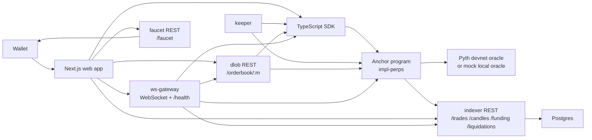

# Architecture

impl.trade is a Solana perpetual-futures stack for capstone/devnet evaluation: an Anchor
program owns settlement and risk, while TypeScript services provide indexing, orderbook
views, keepers, faucet support, and realtime fan-out.

## Components

- `programs/impl-perps`: on-chain engine for collateral, vAMM opens/closes, margin,
  funding, liquidations, insurance/bankruptcy, limit orders, maker matching, triggers, and
  market/protocol circuit breakers.
- `packages/sdk`: typed client, PDA helpers, constants, preview math, and bundled IDL.
- `services/keeper`: cranks funding, liquidations, trigger orders, AMM fills, and
  maker-vs-maker matches.
- `services/dlob`: reads user order accounts and exposes L2 snapshots at `/orderbook/:m`.
- `services/indexer`: decodes program logs into Postgres and exposes history/candles/CSV.
- `services/ws-gateway`: polls chain + REST services and pushes
  `{channel:"snapshot", market, mark, orderbook, trades, ts}` to subscribers.
- `services/faucet`: mints development USDC to a wallet's ATA; the web app then deposits
  those tokens into the program as protocol collateral.
- `scripts`: localnet/devnet bootstrap, development USDC creation, oracle pusher, and smoke
  workflow.

## Data Flow

1. The web app signs transactions through the SDK. Trades settle directly on the Anchor
   program; services never custody user funds.
2. The program emits events for trades, funding, and liquidations.
3. The indexer polls recent program transactions, decodes Anchor events, and upserts them
   into Postgres by `(signature, log_index)`.
4. The DLOB service reads all user accounts, aggregates open limit orders by market/price,
   and serves cached L2 snapshots.
5. The WebSocket gateway combines on-chain mark price, DLOB orderbook, and indexer trades
   into the frontend's live snapshot stream.
6. The keeper is permissionless. Every action is rechecked on-chain, so stale off-chain
   decisions fail without changing protocol state.

## Public Service Surface

- `GET /health` on `dlob`, `indexer`, `ws-gateway`, and `faucet`.
- `GET /orderbook/:market` from DLOB.
- `GET /trades/:market`, `/trades/:market.csv`, `/candles/:market`, `/funding/:market`,
  `/liquidations/:market`, and `/liquidations/:market.csv` from the indexer.
- WebSocket subscribe frame: `{ "op": "subscribe", "market": 0 }`.
- Faucet request: `POST /faucet { "wallet": "<pubkey>" }`.

## Oracle Modes

- Local validator: `IMPL_ORACLE=mock`, with program-owned oracle PDAs updated by
  `scripts/src/push-prices.ts` or direct script calls. This mode is deterministic and exists
  only for local evaluation.
- Devnet/deployed mode: `IMPL_ORACLE=pyth`, with Pyth price-feed accounts derived during
  bootstrap.

## Operational Notes

- Services validate required env on startup and exit with a clear message when missing.
- Long-running services handle `SIGTERM`/`SIGINT` for clean HTTP/WebSocket shutdown.
- Market statuses are enforced on-chain. `Active` allows opening and reducing actions,
  `ReduceOnly` allows only reducing actions, and `Paused` blocks trading cranks while direct
  close and liquidation remain available.
